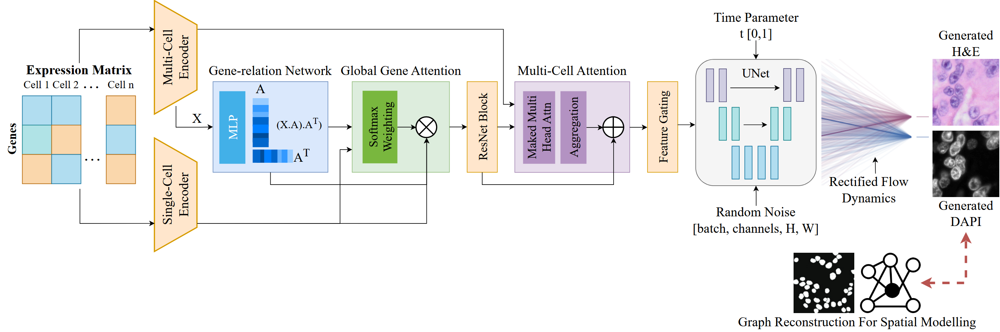

# GeneFlow

[](http://creativecommons.org/licenses/by-nc-nd/4.0/)
[](https://neurips.cc/virtual/2025/poster/114997)
[](https://openreview.net/pdf?id=zyopvwZbSj)
[](#citation)
[](https://www.python.org/downloads/)
[](https://pytorch.org/)

Official implementation of **GeneFlow: Translation of Single-cell Gene Expression to Histopathological Images via Rectified Flow** (NeurIPS 2025).


---

## News

- **November 2025**: Initial release of GeneFlow codebase
- **October 2025**: Preprocessed demo Xenium samples released on Zenodo
- **September 2025**: Paper accepted at NeurIPS 2025

---

## Overview



GeneFlow translates single-cell gene expression profiles to histopathological images using rectified flow models. This approach enables the generation of synthetic tissue images from spatial transcriptomics data, facilitating downstream analyses in computational pathology and spatial biology.

---

## Installation

### Requirements

- CUDA 12.1 compatible GPU (tested on 8×H100 with DDP and 1×H100)
- Conda or Miniconda
- Python 3.11

### Setup

1. **Create conda environment:**
```bash
conda create -n geneflow python=3.11
conda activate geneflow
```

2. **Install PyTorch with CUDA 12.1:**
```bash
conda install pytorch==2.2.2 torchvision==0.17.2 torchaudio==2.2.2 pytorch-cuda=12.1 -c pytorch -c nvidia
```

3. **Install dependencies:**
```bash
pip install -r requirements.txt
```

4. **Verify installation:**
```bash
python -c "import torch; print(f'PyTorch: {torch.__version__}'); print(f'CUDA available: {torch.cuda.is_available()}')"
```

---

## Data

### Download Preprocessed Demo Data

We provide three preprocessed Xenium samples for demonstration, which can be downloaded from https://zenodo.org/records/17429142:

**Sample C1:**
```bash
wget -O xenium_c1.tar.gz "https://zenodo.org/records/17429142/files/Xenium_V1_hSkin_Melanoma_Base_FFPE.tar.gz?download=1"
tar -xzf xenium_c1.tar.gz -C /path/to/GeneFlow/processed_data/
```

**Sample C2:**
```bash
wget -O xenium_c2.tar.gz "https://zenodo.org/records/17429142/files/Xeniumranger_V1_hSkin_Melanoma_Add_on_FFPE.tar.gz?download=1"
tar -xzf xenium_c2.tar.gz -C /path/to/GeneFlow/processed_data/
```

**Sample P1:**
```bash
wget -O xenium_p1.tar.gz "https://zenodo.org/records/17429142/files/Xenium_Prime_Human_Skin_FFPE.tar.gz?download=1"
tar -xzf xenium_p1.tar.gz -C /path/to/GeneFlow/processed_data/
```

### Data Preprocessing

For preprocessing custom Xenium data from HEST-1k:

```bash
python utils/prepare_hestxenium_data.py \
    --input_dir /path/to/GeneFlow/raw/data \
    --output_dir /path/to/GeneFlow/processed_data/ \
    --img_size 256 \
    --img_channels 4
```

---

## Training

Run training with default parameters:

```bash
bash train.sh
```

### Custom Training

Modify `train.sh` or run directly with custom arguments:

```bash
python rectified/rectified_main.py \
    --model_type single \
    --adata /path/to/GeneFlow/processed_data/adata.h5ad \
    --image_paths /path/to/GeneFlow/processed_data/cell_image_paths.json \
    --img_size 256 \
    --img_channels 4 \
    --output_dir /path/to/GeneFlow/results \
    --batch_size 16 \
    --epochs 50 \
    --patience 5 \
    --lr 1e-4 \
    --use_amp
```

### Distributed Training

For multi-GPU training:

```bash
bash train_distributed.sh
```

Or run directly:

```bash
torchrun --nproc_per_node=8 rectified/rectified_main.py \
    --use_ddp \
    --use_amp \
    --model_type single \
    --adata /path/to/GeneFlow/processed_data/adata.h5ad \
    --image_paths /path/to/GeneFlow/processed_data/cell_image_paths.json \
    --img_size 256 \
    --img_channels 4 \
    --output_dir /path/to/GeneFlow/results \
    --batch_size 16 \
    --epochs 50
```

---

## Generation

Generate synthetic histopathological images from gene expression using a pretrained model:

```bash
bash generate.sh
```

### Custom Generation

Modify `generate.sh` or run directly with custom arguments:

```bash
python rectified/rectified_generate.py \
    --model_path /path/to/GeneFlow/results/checkpoints/best_model.pt \
    --model_type single \
    --adata /path/to/GeneFlow/processed_data/adata.h5ad \
    --image_paths /path/to/GeneFlow/processed_data/cell_image_paths.json \
    --img_size 256 \
    --img_channels 4 \
    --output_dir /path/to/GeneFlow/generated_results \
    --batch_size 8 \
    --num_samples 100 \
    --gen_steps 50
```

### Generation Parameters

- `--model_path`: Path to pretrained model checkpoint
- `--num_samples`: Number of samples to generate
- `--gen_steps`: Number of generation steps for rectified flow (default: 50)
- `--enable_stain_normalization`: Apply stain normalization to generated images
- `--stain_normalization_method`: Method for stain normalization (default: skimage_hist_match)

### Output

Generation produces:
- Individual PNG images for each sample (RGB and auxiliary channels)
- Multi-page PDF with all samples (`generation_results.pdf`)
- Preview PNG with first 10 samples (`generation_results.png`)

---

## Evaluation

Run comprehensive evaluation on trained model:

```bash
bash eval.sh
```

### Custom Evaluation

Modify `eval.sh` or run directly with custom arguments:

```bash
python rectified/rectified_evaluate.py \
    --model_path /path/to/GeneFlow/results/checkpoints/best_model.pt \
    --model_type single \
    --adata /path/to/GeneFlow/processed_data/adata.h5ad \
    --image_paths /path/to/GeneFlow/processed_data/cell_image_paths.json \
    --img_size 256 \
    --img_channels 4 \
    --output_dir /path/to/GeneFlow/evaluation_results \
    --batch_size 8 \
    --gen_steps 50 \
    --use_amp
```

### Distributed Evaluation

For multi-GPU evaluation:

```bash
bash eval_distributed.sh
```

Or run directly:

```bash
torchrun --nproc_per_node=8 rectified/rectified_evaluate.py \
    --use_ddp \
    --use_amp \
    --model_path /path/to/GeneFlow/results/checkpoints/best_model.pt \
    --model_type single \
    --adata /path/to/GeneFlow/processed_data/adata.h5ad \
    --image_paths /path/to/GeneFlow/processed_data/cell_image_paths.json \
    --img_size 256 \
    --img_channels 4 \
    --output_dir /path/to/GeneFlow/evaluation_results \
    --batch_size 8 \
    --gen_steps 50
```

### Evaluation Metrics

GeneFlow evaluation includes:

**Image Quality Metrics:**
- SSIM (Structural Similarity Index)
- PSNR (Peak Signal-to-Noise Ratio)
- FID (Fréchet Inception Distance)

**Biological Validation Metrics:**
- UNI2-h FID (using histopathology foundation model)
- Cell type classification accuracy
- Nuclear feature similarity
- Spatial pattern similarity
- UNI2-h embedding similarity

**RNA Prediction Metrics (Round-trip validation):**
- Gene-wise correlation
- Sample-wise correlation
- RNA MSE

### Biological Feature Evaluation

For comprehensive evaluation using biological features, install the required models:

#### Required Tools

1. **Sequoia**: Cell segmentation and feature extraction
   - Repository: [https://github.com/gevaertlab/sequoia-pub](https://github.com/gevaertlab/sequoia-pub)
   - Installation: `pip install sequoia-pub`

2. **UNI2**: Universal histopathology foundation model
   - Model: [https://huggingface.co/MahmoodLab/UNI2-h](https://huggingface.co/MahmoodLab/UNI2-h)

3. **HE2RNA Weights**: Pretrained histology-to-transcriptomics model
   - Weights: [https://huggingface.co/gevaertlab](https://huggingface.co/gevaertlab)

#### Setup Instructions

1. **Download HE2RNA weights:**
```bash
wget -O sequoia/models/he2rna_weights.pt "https://huggingface.co/gevaertlab/he2rna/resolve/main/weights.pt"
```

2. **Modify Sequoia imports** in `sequoia/src/he2rna.py`:
```python
# Replace:
# from src.read_data import SuperTileRNADataset
# from src.utils import patient_split, patient_kfold, custom_collate_fn, filter_no_features

# With:
from .read_data import SuperTileRNADataset
from .utils import patient_split, patient_kfold, custom_collate_fn, filter_no_features
```

3. **Run evaluation with biological models:**
```bash
python rectified/rectified_evaluate.py \
    --model_path /path/to/GeneFlow/results/checkpoints/best_model.pt \
    --model_type single \
    --adata /path/to/GeneFlow/processed_data/adata.h5ad \
    --image_paths /path/to/GeneFlow/processed_data/cell_image_paths.json \
    --output_dir /path/to/GeneFlow/evaluation_results \
    --uni2h_model_path /path/to/uni2h_model \
    --he2rna_weights /path/to/he2rna_weights.pt \
    --save_embeddings \
    --embeddings_output_path /path/to/embeddings
```

### Output

Evaluation produces:
- `evaluation_summary.json`: Overall metrics summary
- `per_sample_metrics.csv`: Per-sample detailed metrics
- `batch_level_biological_validation.csv`: Batch-level biological metrics
- Visualization plots for all metrics
- UNI2-h embeddings (if `--save_embeddings` is enabled)

---

## Citation

If you find this work useful, please cite:

```bibtex
@inproceedings{wanggeneflow,
  title={GeneFlow: Translation of Single-cell Gene Expression to Histopathological Images via Rectified Flow},
  author={Wang, Mengbo and Verma, Shourya and Malusare, Aditya and Wang, Luopin and Lu, Yiyang and Aggarwal, Vaneet and Sola, Mario and Grama, Ananth and Lanman, Nadia Atallah},
  booktitle={The Thirty-ninth Annual Conference on Neural Information Processing Systems},
  year={2025}
}
```

---

## License

This work is licensed under a [Creative Commons Attribution-NonCommercial-NoDerivs 4.0 International License](http://creativecommons.org/licenses/by-nc-nd/4.0/).

[](http://creativecommons.org/licenses/by-nc-nd/4.0/)

**Permitted:**
- Use for academic and research purposes
- Citation in academic publications

**Prohibited:**
- Commercial use
- Distribution of modified versions
- Use in production systems without explicit permission

---

## Contact

For questions, issues, or collaboration inquiries:

- Open an issue on this repository
- Check existing issues before creating new ones
- Provide detailed information for bug reports (OS, CUDA version, error messages)

---

## Acknowledgments

We thank the developers of HEST-1k, Xenium platform, and the computational pathology community for their foundational contributions to spatial biology.